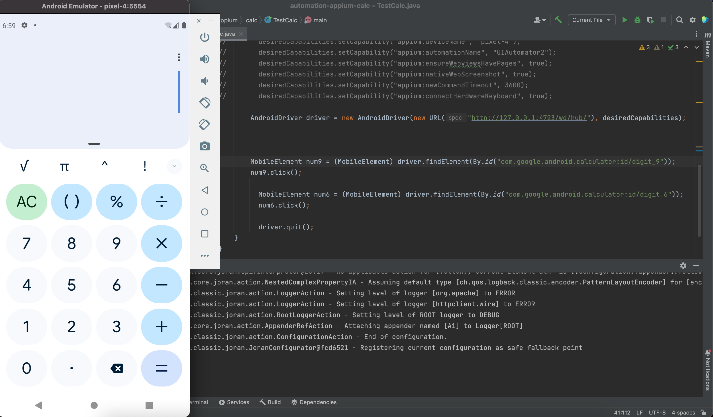
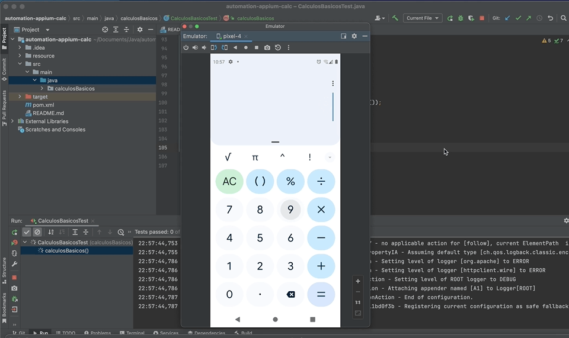

# Testes Automatizados Com Appium - Calculadora

<h1 align="center">
    
</h1>


## Pré-condições:

- Verificar se o dispositivo Android está em funcionamento.
- Verificar se o aplicativo de calculadora já está instalado no dispositivo.

## Cenários de teste:

- Realizar cálculos básicos, como adição, subtração, multiplicação e divisão.
    <h1 align="center" width = "30%">

    </h1>
    
    

- Realizar cálculos com números decimais.
- Verificar a precisão dos resultados dos cálculos.
- Verificar se o aplicativo é capaz de realizar cálculos complexos, como por exemplo, raiz quadrada e potenciação.
- Verificar se o aplicativo permite ao usuário corrigir ou editar uma operação já realizada.
- Verificar se a memória da calculadora funciona corretamente, incluindo as operações de armazenamento, leitura e limpeza da memória.
- Verificar a exibição de mensagens de erro corretas para operações inválidas.

## Critérios de aceitação:

- Todos os cálculos básicos e complexos devem ser realizados corretamente.
- O resultado dos cálculos deve ser preciso.
- O usuário deve ser capaz de corrigir ou editar uma operação já realizada.
- A memória da calculadora deve funcionar corretamente.
- As mensagens de erro devem ser exibidas corretamente para operações inválidas.

## Ambiente de teste:

- Sistema operacional: Android Studio
- Versão do sistema operacional: 11.0
- Dispositivo: Emulador Android
- Versão do aplicativo: 8.2

Este projeto foi desenvolvido utilizando as seguintes tecnologias:

- Java
- Appium
- JUnit
- Maven
- Apk Calculadora

## Clonar o repositório:

```bash
git clone https://github.com/deniscoelho-js/automation-appium-calc.git

```
